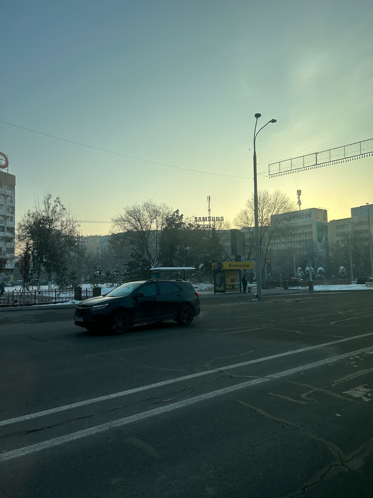

# OSINT  walkthrough

> Sup Folks this is yohannes003 i've been doin some OSINT challenges and now i am going to show you how i found the exact locations... without further a do Let's get started

## challenge 1

*Now we are going to find the exact loaction of this place*
### steps
#### 1, reversing the image

*After doing the reverse image search i have found not only similar pictures like the target but the name of the place as well which is **Chorsu Bazaar***

#### 2, looking it up on google maps

[**click here** to see the location on google maps ](https://www.google.com/maps/dir/41.3273344,69.2830059/Chorsu+Bazaar,+Tafakkur+ko'chasi,+Tashkent,+Uzbekistan/@41.3265781,69.2349869,69m/data=!3m1!1e3!4m8!4m7!1m0!1m5!1m1!1s0x38ae8b9cdd04953d:0xf8109d550917a88e!2m2!1d69.2350318!2d41.3267357?entry=ttu)

#### 3, diving deep into the results of google maps

*by using the street view images i was able to find this location*

[**click here** to see the location on google maps ](https://www.google.com/maps/@41.326992,69.234329,3a,75y,193.02h,104.34t/data=!3m8!1e1!3m6!1sAF1QipNCBd40yminrRv4ggaK7zXae6Y4n-yUIhMGvfNF!2e10!3e11!6shttps:%2F%2Flh5.googleusercontent.com%2Fp%2FAF1QipNCBd40yminrRv4ggaK7zXae6Y4n-yUIhMGvfNF%3Dw900-h600-k-no-pi-14.340108030184226-ya23.023887977348465-ro0-fo90!7i7168!8i3581?coh=205410&entry=ttu)

*And if you look closely there is a clue that helps to identify if we find the exact location of the place or not*

>*In conclusion the the exact location of that place is **41°19'36"N 69°14'06"E***

## challenge 2

*Now we are going to find the exact loaction of this place*
### steps
#### 1, reversing the image

[**click here** to see the location ](https://lens.google.com/search?ep=gsbubb&hl=en-ET&re=df&p=AbrfA8q46ZyYguibM0aOd_aCCSJvMeWCBYM3wtSv0B4spIzqyCEgqAhqnMso_g-SYYsosxQLRjdiCKXquIZHGcvbfPbEJ5HGl8FIflNBSDvkIGjVyW4C-rAFGhs-_BJS1NjM6UmBFC-ShbT8R1VoQrDbExSeaaFbvVUCej3JbdS4iiYZUC7IBPLTsvd5NdavYYhtdn6vHgyviusj0ZJ0m10j#lns=W251bGwsbnVsbCxudWxsLG51bGwsbnVsbCxudWxsLG51bGwsIkVrY0tKRGxqTURjM1pXUTFMV1EzTnpRdE5EZGpaQzFoWlRZekxUSTNOelJtTWpJek4ySmlaQklmYnkxa1R6SlhkME5DU210WFRVbG5SM0JuU1V4dVVESkpjWGsyWjBSQ2F3PT0iLG51bGwsbnVsbCxudWxsLDEsbnVsbCxbbnVsbCxudWxsLFswLDAsMTAwMDAwLDEwMDAwMF1dLG51bGwsWyI2OWM1ZmExNi1iYThjLTRmOGMtODBlYi1jYmRiMDJhNDA2NTkiXV0=)

*on this image there are two main clues that can help us in locating the exact palce*

*The first one is the name of the place which is **HALVA art cafe shop***

*And the second one is the farris wheel*

#### 2, checking those clues 

*After checking the name that we found on the image (HALVA art cafe shop) using google earth we have found both the cafe and the farris wheel*

#### 3, taking closer look trying to get the exact location where the picture was taken

*By using street view on google earth i have found the exact spot where the picture was taken*

[**click here** to see the location](https://earth.google.com/web/search/HALVA+art+cafe+shop/@41.32618951,69.26622238,457.28619085a,720.94479071d,35y,0h,0t,0r/data=Cn4aVBJOCiUweDM4YWU4YmJkZWI5Y2JmZjU6MHgzNGU2YTFhOTM2NDI5ZmY3GRxFMdS8qURAIaj0XVsJUVFAKhNIQUxWQSBhcnQgY2FmZSBzaG9wGAEgASImCiQJXwkI0_ypREARdtmbQl6pREAZnA7COX5RUUAhfJbs3JRQUUA6AwoBMA)

*After that by inspecting the pointed location this was the result*

>*In conclusion the exact location of that place is:- **41°19'34.0"N 69°15'58.0"E***

## challange 3 

*Now we are going to find the exact loaction of this place*
### steps 
#### 1, Finding clues in the image

*So now i have found two clues in this picture that might lead us to the exact location of this place*

*The first one is the building that has the **samsung Galaxy logo** in it and the second one is the **bus stop***

*The word on the bus stop sign says **KapitalBank** which helped in narrowing down the search space ... KapitalBank is Kapital Bank is a commercial bank operating in Azerbaijan which indicates that this picture was taken in **Azerbaijan , Baku***

*The building with the samsung logo wasn't that much help so i will be using **geospy.ai***

#### 2. observing the image 

*judging by the surroundings it looks like this picture is near bus/subway station after searching for bus/subway stations around Baku i couldn't find the place which indicates that the country/city that i got might be wrong*

*The privious OSINT challanges were in uzbekistan which then i used to search for all bus/subway stations near it and i got the exact place*

[**Click her to see the location**](https://earth.google.com/web/search/77XF%2bQJ+Tashkent,+Uzbekistan/@41.2994537,69.2734985,446.22798765a,0d,60y,97.94501994h,100.35907751t,0r/data=CocBGl0SVwolMHgzOGFlOGIwY2MzNzllOWMzOjB4YzYyYzQzMDNjMzIzODEzMxkW2c73U6ZEQCHXo3A9ilFRQCocNzdYRitRSiBUYXNoa2VudCwgVXpiZWtpc3RhbhgBIAEiJgokCc89sy5-rkRAEYp05iHFq0RAGWzYMUS1U1FAIfwqXqEZUlFAIjAKLEFGMVFpcE9kZjZaRDFKNHZWX3dNdWtPMkJzWjR6Uk1LbTBOYkRMaEpfX2p0EAU6AwoBMA)

*In conclcusion the exact loaction is:- **77XF+QJ Tashkent, Uzbekistan***

